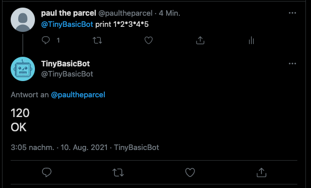

# Tiny Basic

This is a Tiny Basic interpreter written in Python.

To find out more about Tiny Basic, check https://en.wikipedia.org/wiki/Tiny_BASIC

There was a challenge, posted by Jeff Atwood (coding-horror), to bring 100 ancient basic games back to life by porting them to mordern languages. 
The idea is to teach how you would do it nowadays.
I looked at it and walked in the wrong direction and built a basic interpreter, just for fun. It's an implementation of Tiny Basic, a very limited Basic.
It has no loops, no functions, very limited variables. It feels a bit like an
assembler of sorts.

https://github.com/coding-horror/basic-computer-games

This version of Tiny Basic differs from its initial specification:
* it supports floats
* it supports TAB() to ease print formatting
* it has built in functions like ABS, INT, SQR and RND

The interpreter has no real purpose except amusement. 

## Running

You run it like so:
`tb.py <filename>`
or without parameter to run it in repl mode.

A simple program to compute sine:
```basic
10 PRINT "COMPUTING SIN(X)"
20 PRINT "ANGLE",
30 INPUT X
40 REM sin x = x − x^3/3! + x^5/5! − x^7/7!
50 LET X = X/180*3.141592
60 LET A = X*X*X
70 LET B = A*X*X
80 LET C = B*X*X
90 LET S = X - A/6 + B/120 - C/5040
100 PRINT "SIN=",S
110 END
```

In repl mode you can ommit the line numbers. If you do, the statement will be executed directly. If you enter a statement including a line number, it will be stored in memory.
```
./tb.py 
Tiny Basic v0.1
LET A=5
OK
10 PRINT A
20 IF A = 0 THEN GOTO 100
30 LET A = A-1
40 GOTO 10
100 END
RUN
5
4
3
2
1
0
OK
```

Another option is to use stdin with a file in repl mode.
```
tb.py < input_file
```
If you are using this option, don't forget to include a `RUN` statement at the end. Otherwise it would just load the program into memory and then exit. You can/should include keyboard input as well.
This may be the contents of an input file:
```
10 PRINT "Factorial"
20 PRINT "Enter an integer: ",
30 LET F = 1
40 INPUT N
50 IF N = 0 THEN GOTO 90
60 LET F = F * N
70 LET N = N - 1
80 GOTO 50
90 PRINT F
RUN
5
```


## Twitter bot

There is  a twitter bot, based on this interpreter, that reads tweets, addressed to it, and then replies with the output of the statement or program.
Take a look at http://twitter.com/TinyBasicBot


* The whole program has to fit into a single tweet (even 280 chars is enough for tiny programs). There is nothing, that survives the execution. The next tweet will find an empty memory.
* Output is limited. It will get truncated at 260 chars. You can not use '@' in the output.
* Execution is limited. Execution will stop after 1000 statements and return an error.
* Retweets will be ignored.
* Tweets mentioning the TinyBasicBot in the middle of the message, like `Hello @TinyBasicBot`, will be ignored.
* Tweets mentioning other users besides @TinyBasicBot will be ignored.
* Tweets currently take up to two minutes to process.



## Statements

Special formatting for the PRINT statement is possible.
* Separating expressions by `,` prints without any space
* Separating expressions by `;` prints with a single space
* TAB(x) sets the cursor to position x
* a trailing `,` omits the CR at the end and makes it possible to have the 
input `?` on the same line

The `FOR` loop can be used with or without the `STEP` parameter. If `STEP` is omitted, the step defaults to `+1`. The end of the `FOR` loop is controlled with the `NEXT` statement. It does not have the loop variable next to it. The `NEXT` statement is automatically associated with the last `FOR` statement. `FOR` loops can be nested.
```basic
10 FOR X = 0 TO 3 STEP 1
20 FOR Y = 0 TO 3 STEP 1
30 PRINT "x:",X,",y:",Y
40 NEXT
50 NEXT
60 END
```

## Bugs

I'm sure there are lot.
If you find any, please report them here https://github.com/tinkerlog/tiny_basic/issues


## Grammar
```
line ::= 
	number statement | statement
 
statement ::= 
	'PRINT' expr-list |
	'IF' expression relop expression 'THEN' statement |
	'GOTO' expression |
	'INPUT' var-list |
	'LET' var '=' expression |
	'FOR' var '=' expression 'TO' expression |
	'FOR' var '=' expression 'TO' expression 'STEP' expression |
	'NEXT' |
	'GOSUB' expression |
	'RETURN' |
	'END' |
	'LIST' |
	'RUN' |
	'CLEAR' 

expr-list ::= 
	(tab | string | expression) (',' (tab | string | expression))*

tab ::=
	'TAB(' expr ')'
 
var-list ::= 
	var (',' var)*
 
expression ::=
	term (('+' | '-') term)*
 
term ::= 
	factor (('*' | '/' | 'MOD') factor)*
 	
factor ::= 
	'+' factor |
	'-' factor |
	var |
	number |
	function |
	'(' expression ')'
 
function ::=
	'INT(' expression ')' |
	'SQR(' expression ')' |
	'RND(' expression ')' |
	'ABS(' expression ')'

var ::= 
	'A' | 'B' | ... | 'Z'
 
number ::= 
	integer | float

integer ::=
	digit_seq

float ::=
	(digit_seq '.' digit_seq) 

digit_seq ::=
	digit digit*

digit ::= 
	'0' | '1' | ... | '9'
 
relop ::= 
	'<' | '=' | '>' | '<=' | '>=' | '<>'

string ::= 
	" ( |!|#|$ ... -|.|/|digit|: ... |A| ... |Z)* "
```

## Have fun.